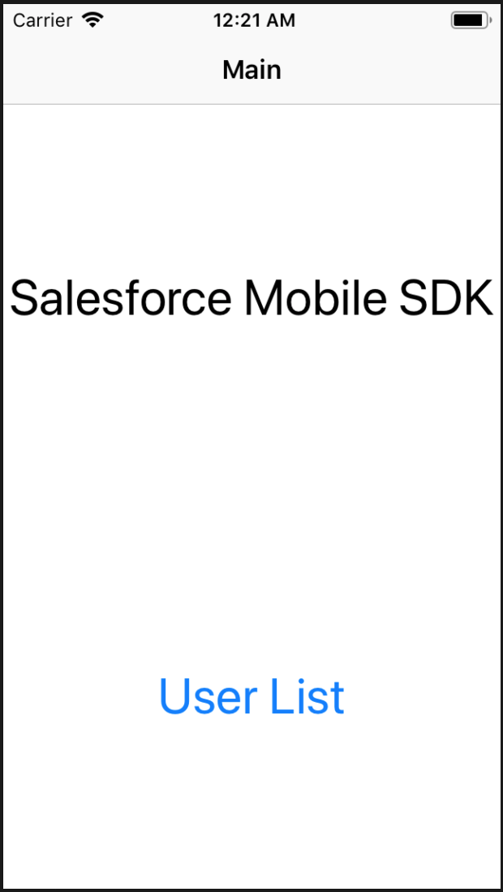

## Salesforce

*Salesforceと連携するアプリ(Mobile SDKは各自でセットアップして下さい)*

1. 概要

    - Salesforceにログインしてデータを操作する

1. 環境

    - Xcode 10.1
    - Swift 4.2.1
    - Forceios 7.0.0
    - Man-hour 2.0h

1. 学び / ポイント

    - Salesforce Mobile SDKの使い方 / SalesforceSDKCore

1. イメージ

    |                           Screen1                           |     |                           Screen2                           |     |                           Screen3                           |
    |-------------------------------------------------------------|-----|-------------------------------------------------------------|-----|-------------------------------------------------------------|
    |  | >>> |  | >>> |  |

1. ソースコード

    [GitHub](https://github.com/nsuhara/swift-Salesforce.git)
